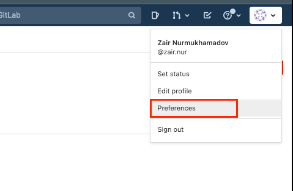
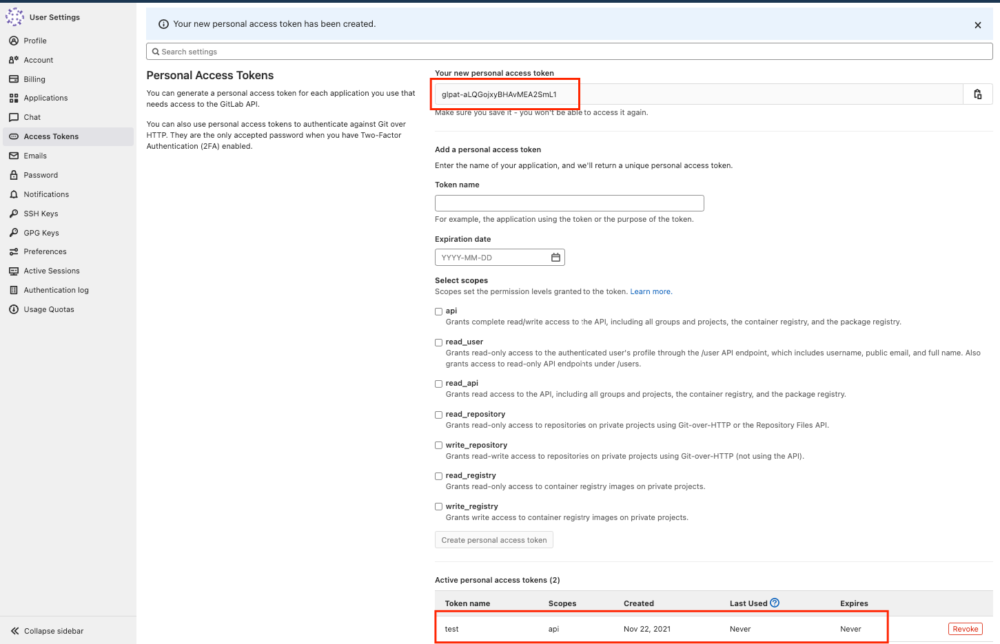

# Laravel Api Auth

## Вступление
> Laravel пакет для быстрого развертывания авторизацию.

## Todo
- [ ] нужно для всех контроллеров повесить событий (до, после и во время)
- [ ] Обработать exception 
- [ ] Установить статические анализаторы (phpstan, phpcs ...)
- [ ] Дописать тесты (Unit)
- [ ] Дописать ответы ошибок - swagger документация (docs/swagger.json)

## API документация
Api документация написано на swagger-e  
Документация docs/swagger.json

## Установка
Так как наш репозиторий является приватным, нам сначала нужно авторизоваться в композере:
1. Нам нужно получить access token от gitlab    
    
    
    
   
2. Авторизуемся:
```bash
composer config http-basic.gitlab.com ___token___ <ACCESS_TOKEN> # вместо <ACCESS_TOKEN> вставьте ваш ACCESS_TOKEN из предыдущего шага  
```

3. Устанавливаем:
```bash
composer config repositories.gitlab.com/14060480 '{"type": "composer", "url": "https://gitlab.com/api/v4/group/14060480/-/packages/composer/packages.json"}'
```
```bash
composer req future/lara-api-auth
```
Или выбрать конкретную версию пакета
```bash
composer req future/lara-api-auth:0.1.0
```
> Примеры взято из Packages & Registries -> Package Registry 


Опционально: для публикации конфигурации
```bash
php artisan vendor:publish --provider="Future\LaraApiAuth\LaraApiAuthServiceProvider"
```

Выполняем миграцию
```bash
php artisan migrate
```
Эта команда создаст ключи шифрования, необходимые для создания токенов безопасного доступа. 
Кроме того, команда создаст клиентов «персональный доступ» и «предоставление пароля», 
которые будут использоваться для генерации токенов доступа.
```bash
php artisan passport:install
```

После выполнения команды passport:install добавьте трейт Laravel\Passport\HasApiTokens 
в вашу модель App\Models\User. Эта черта предоставит вашей модели несколько
вспомогательных методов, которые позволят вам проверить токен
и области аутентифицированного пользователя:
```php
<?php

namespace App\Models;

use Illuminate\Database\Eloquent\Factories\HasFactory;
use Illuminate\Foundation\Auth\User as Authenticatable;
use Illuminate\Notifications\Notifiable;
use Laravel\Passport\HasApiTokens;

class User extends Authenticatable
{
    use HasApiTokens, HasFactory, Notifiable;
}
```

Наконец, в файле конфигурации вашего приложения config/auth.php 
вы должны установить для параметра драйвера (driver) защиты аутентификации api значение passport. 
Это укажет вашему приложению использовать TokenGuard Passport при аутентификации входящих запросов API:
```php
'guards' => [
    'web' => [
        'driver' => 'session',
        'provider' => 'users',
    ],

    'api' => [
        'driver' => 'passport',
        'provider' => 'users',
    ],
]
```
В конце:
```bash
php artisan config:cache
php artisan route:cache
```